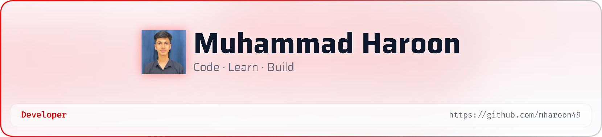

<!-- =========================================================
     🌌 MUHAMMAD HAROON — GITHUB PROFILE README
     ========================================================= -->

<!-- Responsive Dark / Light Banner -->
<picture>
   <source media="(prefers-color-scheme: dark)" srcset="art/header-dark.png">
   
</picture>

# Hey there, I'm Haroon 👋

### `CS Student` • `Developer in Progress` • `Problem Solver`

 

&nbsp;

&nbsp;

  
 
💻 **Web Development + Computer Science**  
🎓 **Currently completing Harvard's CS50**

---

## 👨‍💻 About Me

<table>
<tr>
<td width="65%" valign="top">

### Hello! I'm Haroon 👋

I'm a **Computer Science student** focused on building a strong foundation in **programming, algorithms, and software development**.

I'm currently completing **Harvard's CS50** while developing my skills in **C, HTML, and CSS** through hands-on learning and practical projects.

I'm particularly interested in:

- 🧠 Programming logic & problem-solving
- 🌐 Web development
- ⚙️ Automation
- 💻 Computer systems
- 📚 Algorithms & Data Structures
- 🚀 Building practical projects

My goal is simple:

> **Learn deeply → Build consistently → Improve continuously.**

I'm currently at the beginning of my CS journey, but I'm focused on developing strong fundamentals rather than simply learning syntax.

 

**📌 Current Focus**

`C` • `HTML` • `CSS` • `CS50`

</td>

<td width="35%" align="center" valign="middle">

  

</td>
</tr>
</table>

---

## 🛠️ Tech Stack

### Languages & Web

  

### Tools & Platforms

---

## 🧠 Core Skills

| Category | Technologies |
|:---:|:---:|
| **Languages** | C |
| **Web** | HTML • CSS |
| **Tools** | VS Code • GitHub |
| **Learning** | Harvard CS50 |
| **Interests** | Algorithms • Data Structures • Automation • Computer Systems |

 ---
## 📊 GitHub Statistics

&nbsp;&nbsp;

 

---

## 📈 Contribution Activity

---

## 🐍 Contribution Snake

<!--
=========================================================
GitHub Action required to generate the contribution snake.

Create:
.github/workflows/snake.yml

Use:

name: Generate Snake

on:
  schedule:
    - cron: "0 0 * * *"
  workflow_dispatch:

jobs:
  generate:
    runs-on: ubuntu-latest

    steps:
      - uses: Platane/snk@v3
        with:
          github_user_name: ${{ github.repository_owner }}
          outputs: |
            dist/github-contribution-grid-snake.svg
            dist/github-contribution-grid-snake-dark.svg?palette=github-dark

      - uses: crazy-max/ghaction-github-pages@v4
        with:
          build_dir: dist
        env:
          GITHUB_TOKEN: ${{ secrets.GITHUB_TOKEN }}
-->
 📫 Connect With Me

&nbsp;&nbsp;

     

